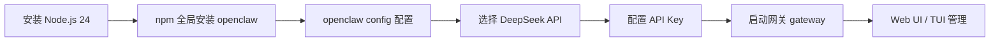

# 实习项目总结报告

> **实习生：** 冉星宏
> **时间：** 2025年
> **方向：** AI 数据处理与部署

---

## 目录

1. [项目总览](#一项目总览)
2. [环境与工具部署](#二环境与工具部署)
3. [项目一：CSV to JSONL 数据清洗流水线](#三项目一csv-to-jsonl-数据清洗流水线)
4. [项目二：本地 RAG 知识库问答系统](#四项目二本地-rag-知识库问答系统)
5. [项目三：OpenClaw AI Agent 部署](#五项目三openclaw-ai-agent-部署)
6. [遇到的问题与解决方案汇总](#六遇到的问题与解决方案汇总)
7. [成果总结](#七成果总结)

---

## 一、项目总览

本实习阶段完成了 **三个完整项目**，覆盖了从数据处理、本地 AI 应用到 AI Agent 框架部署的完整技术链条：

| 项目 | 核心内容 | 技术栈 |
|------|---------|--------|
| CSV to JSONL 数据清洗流水线 | CSV 转 JSONL，支持缺失值填充、列筛选、统计分布、多分支扩展 | Python, Pandas, Docker, LangChain, Ollama |
| 本地 RAG 知识库问答系统 | 基于本地文档的检索增强生成问答系统，支持 CLI 和 Web UI | LangChain, Chroma, Ollama, Streamlit |
| OpenClaw AI Agent 部署 | AI Agent 框架安装配置与网关部署 | OpenClaw, Node.js, DeepSeek API |

所有项目代码均托管在 GitHub 公开仓库，配有完整的 README、运行截图和 Docker 支持。

---

## 二、环境与工具部署

### 2.1 硬件与操作系统

| 组件 | 配置 |
|------|------|
| 操作系统 | Windows 11 22H2 |
| Linux 子系统 | WSL 2 Ubuntu-22.04 |
| 内存 | 满足 Docker + Ollama + 开发工具并行运行 |

### 2.2 开发工具链

| 工具 | 版本 | 用途 |
|------|------|------|
| Docker Desktop | 最新版 | 容器化运行环境，启用 WSL 2 集成 |
| Git | 2.53.0 | 版本控制与 GitHub 远程仓库管理 |
| Python (Anaconda) | 3.9+ | 数据处理与 RAG 项目开发 |
| Ollama | 0.24.0 | 本地运行大语言模型与嵌入模型 |
| Node.js | v24.15.0 | OpenClaw 运行环境 |
| VS Code | - | 代码编辑与调试 |

### 2.3 关键环境配置

- **Git 配置：** 配置 `user.name` 和 `user.email`，生成 SSH 密钥并添加到 GitHub 账户
- **Docker 集成：** Docker Desktop 启用 WSL 2 集成，使 WSL 内可直接运行 `docker` 命令
- **Ollama 部署：** 在 Windows 后台运行 Ollama 服务，拉取 `qwen:4b`（生成模型）和 `nomic-embed-text`（嵌入模型）

---

## 三、项目一：CSV to JSONL 数据清洗流水线

### 3.1 项目概述

- **仓库地址：** [https://github.com/RXH99/csv-to-jsonl-tool](https://github.com/RXH99/csv-to-jsonl-tool)
- **目标：** 开发一个轻量级数据转换工具，将 CSV 文件转换为 JSONL 格式（每行一个 JSON 对象），支持数据清洗常用操作，并通过 Docker 确保环境一致性。

### 3.2 功能特性

| 功能 | 说明 |
|------|------|
| CSV → JSONL 转换 | 将任意 CSV 文件转换为标准 JSONL 格式 |
| 缺失值填充（`--fillna`） | 支持指定默认值填充空值，如 `--fillna 0` 或 `--fillna "unknown"` |
| 列筛选（`--columns`） | 只保留指定列，如 `--columns name,age` |
| 统计分布（`--stats`） | 输出指定列的统计信息：数值列显示均值/中位数/极值，分类列显示频次占比 |
| 示例数据生成（`--generate-sample`） | 一键生成测试用 CSV 数据 |
| Docker 封装 | 一键构建镜像，消除环境差异 |

### 3.3 技术栈

```
Python 3.9+  →  Pandas  →  Docker  →  Git
                        ↕
         LangChain + Ollama（deploy 分支）
```

- **核心语言：** Python 3.9+
- **数据处理：** Pandas（DataFrame 操作）、NumPy（数值计算）
- **容器化：** Docker（Dockerfile + requirements.txt）
- **版本控制：** Git（多分支管理）
- **扩展集成：** LangChain + Ollama（deploy 分支）

### 3.4 分支结构

| 分支 | 功能 |
|------|------|
| `main` | 基础数据清洗功能（CSV → JSONL + 缺失值处理 + 统计） |
| `deploy` | 集成 LangChain + Ollama，调用本地 `qwen:4b` 模型 |
| `data-agent` | 模拟 AI 编程助手交互，记录 UnifiedDiff 补丁，验证数据完整性，输出 JSONL 格式交互日志 |

### 3.5 典型使用流程

```bash
# 生成示例数据
python csv_to_jsonl.py --generate-sample

# 数据转换与清洗
python csv_to_jsonl.py \
  --input sample_data.csv \
  --output output/data.jsonl \
  --fillna 0 \
  --columns id,name,age,score,category \
  --stats age

# Docker 运行
docker build -t csv-to-jsonl .
docker run --rm -v $(pwd)/data:/app/data csv-to-jsonl \
  --input /app/data/sample.csv --output /app/data/output.jsonl
```

### 3.6 遇到的问题与解决

| 问题 | 原因 | 解决方案 |
|------|------|----------|
| Docker 镜像拉取超时 | 默认镜像源为 Docker Hub，国内网络访问慢 | 配置国内镜像源（清华大学、阿里云镜像加速器） |
| Git push SSL 错误 | SSL 证书验证失败（网络环境问题） | 临时禁用 SSL 验证：`git config --global http.sslVerify false` |
| LangChain 导入错误 | `RecursiveCharacterTextSplitter` 位置变更 | 改用 `from langchain_text_splitters import ...` |
| Chroma 持久化错误 | `Chroma.persist()` 在新版中已废弃 | 删除该调用，新版 Chroma 自动持久化 |

---

## 四、项目二：本地 RAG 知识库问答系统

### 4.1 项目概述

- **仓库地址：** [https://github.com/RXH99/local-rag-demo](https://github.com/RXH99/local-rag-demo)
- **目标：** 构建一个完全离线的本地知识库问答系统，基于检索增强生成（RAG）技术，使用 Ollama 本地模型实现文档检索与智能回答。

### 4.2 系统架构

```
                    ┌──────────────────┐
                    │  本地文本文档 .txt  │
                    └────────┬─────────┘
                             ↓
                    ┌──────────────────┐
                    │   文档切片 (Chunk) │
                    │  chunk_size=500   │
                    └────────┬─────────┘
                             ↓
                    ┌──────────────────┐
                    │  向量嵌入 (Chroma) │
                    │ nomic-embed-text  │
                    └────────┬─────────┘
                             ↓
         ┌───────────────────────────────────┐
         │         用户问题                   │
         └────────┬──────────────────────────┘
                  ↓
         ┌──────────────────┐     ┌──────────────────┐
         │  语义检索 (MMR)   │ ←── │  向量数据库 Chroma │
         └────────┬─────────┘     └──────────────────┘
                  ↓
         ┌──────────────────┐
         │  qwen:4b 生成回答  │
         └────────┬─────────┘
                  ↓
         ┌──────────────────┐
         │   CLI / Streamlit  │
         │     输出结果      │
         └──────────────────┘
```

### 4.3 功能特性

- **文档加载：** 支持加载本地 `.txt` 文件，自动读取并切片
- **向量索引构建：** 使用 `nomic-embed-text` 嵌入模型，构建 Chroma 向量数据库
- **检索增强生成：** 基于用户问题，从知识库中检索相关文档片段，作为上下文提供给 LLM 生成回答
- **MMR 检索：** 使用最大边际相关性（MMR）检索，兼顾相关性与多样性
- **双界面支持：** 命令行交互（`qa.py`）+ Streamlit Web 界面（`app.py`）

### 4.4 技术栈

```
┌─────────────────────────────────────────┐
│              Streamlit (Web UI)          │
├─────────────────────────────────────────┤
│           LangChain (Orchestration)      │
├──────────────────┬──────────────────────┤
│  Chroma (向量库)   │  Ollama (本地模型)    │
│                  │  ├─ qwen:4b (生成)    │
│                  │  └─ nomic-embed-text  │
└──────────────────┴──────────────────────┘
```

- **框架：** LangChain（langchain-classic + langchain-ollama + langchain-chroma）
- **向量数据库：** Chroma
- **嵌入模型：** `nomic-embed-text`（Ollama）
- **生成模型：** `qwen:4b`（Ollama，4B 参数）
- **Web 界面：** Streamlit

### 4.5 项目结构

```
.
├── data/                  # 原始文本文档
│   ├── about_me.txt
│   ├── docker_tips.txt
│   ├── git_workflow.txt
│   └── rag_intro.txt
├── chroma_db/             # 向量数据库（.gitignore 忽略）
├── build_vector_store.py  # 构建向量索引
├── qa.py                  # 命令行问答交互
├── app.py                 # Streamlit Web 界面
├── requirements.txt       # 依赖管理
└── README.md              # 项目文档
```

### 4.6 使用方式

```bash
# 1. 构建向量库
python build_vector_store.py

# 2. 命令行问答
python qa.py
> 输入问题：什么是 RAG？
> 回答：RAG 是 Retrieval-Augmented Generation 的缩写...

# 3. Web 界面（可选）
streamlit run app.py
```

### 4.7 遇到的问题与解决

| 问题 | 原因 | 解决方案 |
|------|------|----------|
| 检索结果不准确（RAG 定义答错） | chunk 大小过小，文档中 RAG 关键词分散 | 增加 `chunk_size` 至 500，使用 MMR 检索，在文档中重复关键词 |
| `langchain_chroma` 模块缺失 | 旧版 langchain 未包含 Chroma 集成包 | 执行 `pip install langchain-chroma` |
| `OllamaEmbeddings` 废弃警告 | LangChain 更新了模型导入路径 | 改用 `from langchain_ollama import OllamaEmbeddings` |
| Streamlit 页面空白 | transformers 库警告干扰渲染 | 安装 `torchvision` 或屏蔽 transformers 警告信息 |
| Ollama 连接失败 | 服务未运行或跨容器网络不通 | 确保 Ollama 服务运行中；Docker 环境下配置 `host.docker.internal` 或 Windows 主机 IP |

### 4.8 检索优化经验

通过多次迭代调试，总结出提高 RAG 检索质量的关键参数：

- **chunk_size = 500：** 保证每个片段包含完整语义单元
- **MMR 检索：** 引入多样性，避免返回过于相似的结果
- **关键词冗余：** 在文档中适当重复核心术语，提高匹配概率
- **chunk_overlap 适当设置：** 保持上下文连贯性

---

## 五、项目三：OpenClaw AI Agent 部署

### 5.1 项目概述

- **目标：** 在 WSL (Ubuntu-22.04) 环境中安装并配置 OpenClaw AI Agent 框架，实现 Web UI 和 TUI 的双界面管理。

### 5.2 安装与配置流程



**详细步骤：**

1. 在 WSL (Ubuntu-22.04) 中执行官方安装脚本：
   ```bash
   curl -fsSL https://openclaw.ai/install.sh | bash
   ```
2. 自动安装 Node.js 24 + npm，全局安装 `openclaw` 包到 `~/.npm-global`
3. 运行 `openclaw config` 配置模型提供商
4. 选择 **DeepSeek API** 作为后端模型，输入 API Key
5. 启动网关：`openclaw gateway`
6. 访问 Web UI：`http://127.0.0.1:18789/#token=...`

### 5.3 技术栈

| 组件 | 版本/说明 |
|------|-----------|
| OpenClaw | 2026.5.28 |
| Node.js | v24.15.0 |
| 操作系统 | WSL 2 Ubuntu-22.04 |
| 后端模型 | DeepSeek API（在线）/ qwen:4b（本地尝试） |

### 5.4 遇到的问题与解决

| 问题 | 原因 | 解决方案 |
|------|------|----------|
| GitHub 克隆失败（端口 22 拒绝） | 网络环境限制 SSH 22 端口 | 配置 SSH 改用 443 端口转发：编辑 `~/.ssh/config` |
| npm 全局目录无写权限 | 默认安装到系统目录 `/usr/local/lib` | 安装脚本自动切换为用户级目录 `~/.npm-global` |
| `openclaw dashboard` 未输出 token | 命令执行问题 | 从配置文件 `~/.openclaw/openclaw.json` 手动提取 token |
| 切换到 Ollama 导致配置损坏 | 配置格式不兼容 | 恢复配置文件备份，回退到 DeepSeek API |
| Web UI 响应慢 | 跨境网络延迟 | 接受为正常现象，本地模型方案未成功 |

### 5.5 当前运行状态

- ✅ 网关运行正常
- ✅ Web UI 和 TUI 双界面可用
- ✅ DeepSeek API 作为后端模型，功能完整
- ⏳ 本地 Ollama 切换：未成功（配置兼容性问题，暂不处理）

---

## 六、遇到的问题与解决方案汇总

### 6.1 网络与访问问题

| 问题 | 涉及项目 | 解决方案 |
|------|---------|----------|
| Docker 镜像拉取慢 | 项目一 | 配置清华大学/阿里云镜像加速器 |
| Git push SSL 错误 | 项目一 | 临时禁用 SSL 验证 |
| GitHub SSH 端口 22 拒绝 | 项目三 | 改用 443 端口：编辑 `~/.ssh/config` |
| Web UI 响应慢 | 项目三 | 归因为跨境延迟，接受现状 |

### 6.2 依赖与 API 变更问题

| 问题 | 涉及项目 | 解决方案 |
|------|---------|----------|
| LangChain 导入路径变更 | 项目一、二 | 查询最新文档，使用新导入路径 |
| Chroma 持久化 API 废弃 | 项目一 | 删除废弃调用，利用自动持久化 |
| langchain_chroma 未安装 | 项目二 | 单独安装 `langchain-chroma` 包 |
| OllamaEmbeddings 废弃 | 项目二 | 更新为 `langchain_ollama` 新路径 |

### 6.3 配置与环境问题

| 问题 | 涉及项目 | 解决方案 |
|------|---------|----------|
| npm 全局安装权限 | 项目三 | 安装脚本自动处理为用户级目录 |
| Ollama 连接失败 | 项目二、三 | 确保 Ollama 服务运行 / 配置跨网络访问 |
| OpenClaw 配置损坏 | 项目三 | 从备份恢复配置文件 |

---

## 七、成果总结

### 7.1 项目成果

| 维度 | 成果 |
|------|------|
| **项目数量** | 3 个完整项目，全部托管在 GitHub 公开仓库 |
| **代码质量** | 完整的 README 文档、运行截图、Docker 支持 |
| **技术覆盖** | Python 数据处理、Docker 容器化、Git 版本控制与分支管理、LangChain 应用开发、RAG 系统构建、AI Agent 框架部署 |

### 7.2 技术能力提升

- **Python 数据处理：** 熟练使用 Pandas 进行 CSV/JSONL 数据转换与清洗
- **Docker 容器化：** 独立编写 Dockerfile，解决国内镜像源配置问题
- **Git 版本控制：** 多分支管理（main / deploy / data-agent），Pull Request 工作流
- **LangChain 应用：** 文档切片、向量索引构建、检索增强生成全流程开发
- **本地模型部署：** Ollama 加载与管理，嵌入模型与生成模型的搭配使用
- **AI Agent 框架：** OpenClaw 安装配置、网关管理、模型提供商配置

### 7.3 实习方向匹配

本项目经历与 **AI 数据训练与部署** 方向高度匹配：

1. **AI 数据训练：** `data-agent` 分支记录的 UnifiedDiff 补丁、JSONL 交互日志，正是 AI 编程助手训练所需的数据格式
2. **AI 部署：** Ollama 本地模型 + LangChain RAG 系统 + OpenClaw Agent 框架，覆盖了从模型加载到应用交付的完整链路
3. **问题解决能力：** 独立排查网络、依赖变更、API 废弃、配置错误等多种实际问题

### 7.4 GitHub 仓库

| 项目 | 链接 |
|------|------|
| CSV to JSONL 数据清洗工具 | [https://github.com/RXH99/csv-to-jsonl-tool](https://github.com/RXH99/csv-to-jsonl-tool) |
| 本地 RAG 知识库问答系统 | [https://github.com/RXH99/local-rag-demo](https://github.com/RXH99/local-rag-demo) |

---

> **总结：** 本次实习完成了从数据处理 → 本地 AI 应用 → AI Agent 框架部署的完整技术链实践。三个项目环环相扣，在技术深度和广度上都取得了实质性进展。通过独立解决部署环境中的各类实际问题（网络、依赖、API 变更、配置错误），展示了扎实的工程能力和学习能力。

---

*文档生成日期：2025 年 6 月*
